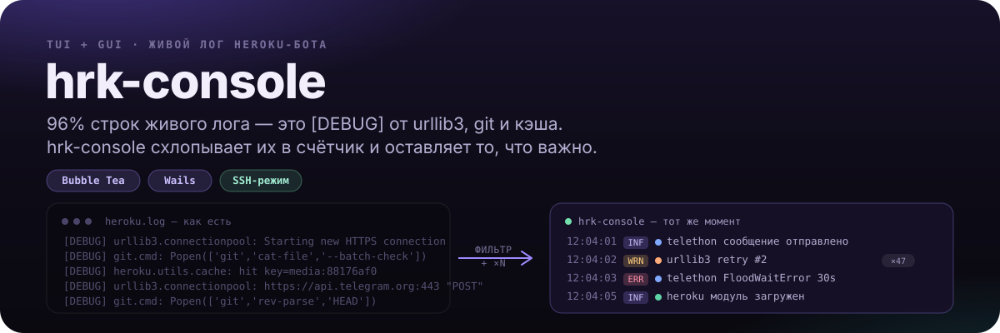
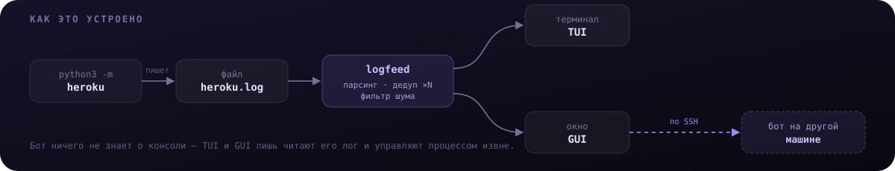

<p align="center">
  
</p>

<div align="center">

[](https://github.com/ayanamisuicide/hrk-console/actions/workflows/ci.yml)
[](https://github.com/ayanamisuicide/hrk-console/releases/latest)
[](go.mod)

</div>

**hrk-console** — консоль для Telegram-юзербота [Heroku](https://github.com/coddrago/Heroku): запуск, остановка и живой просмотр лога, в терминале или в нативном окне.

## Почему не просто `tail -f`

Бот ничего не знает о консоли — это обычный процесс, который пишет `heroku.log` и живёт своей жизнью. hrk-console лишь читает этот файл и управляет процессом извне, без какого-либо API у бота: значит, работает с любым запущенным ботом сразу, ничего не патча в нём самом.

<p align="center">
  
</p>

TUI и GUI — независимые витрины над одними и тем же пакетами (`botproc`, `logfeed`, `state`), поэтому ведут себя одинаково и различаются только тем, как рисуют. Подробнее — в [docs/architecture.md](docs/architecture.md).

## Быстрый старт

```sh
git clone https://github.com/ayanamisuicide/hrk-console ~/heroku-console
cd ~/heroku-console
make build
./bin/hkc
```

Нужен [Go](https://go.dev) — если его ещё нет, команды установки есть в [документации](docs/setup.md#go).

Нативное окно вместо терминала ставится отдельно — с ярлыком в меню приложений и на рабочем столе (нужен [Wails](https://wails.io), см. [подробности](docs/usage.md#gui)):

```sh
./gui/install.sh
```

Окно необязательно держать на той же машине, где стоит бот — есть готовая сборка под Windows в [релизах](https://github.com/ayanamisuicide/hrk-console/releases/latest), подключается к боту на Linux по SSH (см. [«Бот на другой машине»](docs/usage.md#бот-на-другой-машине)).

> [!IMPORTANT]
> Перед первым запуском нужно один раз войти в аккаунт Telegram вручную — консоль запускает бота в фоне и ответить на его вопросы про `api_id` и код из Telegram будет некому. Как это сделать: [docs/setup.md](docs/setup.md#вход-в-аккаунт-telegram).

## Документация

| | |
| --- | --- |
| [Установка и первый запуск](docs/setup.md) | Go, сборка, вход в аккаунт, Windows/WSL, ярлык на рабочем столе |
| [Использование](docs/usage.md) | Режимы, клавиши, GUI, как читается строка лога |
| [Устройство проекта](docs/architecture.md) | Из чего собрано и почему именно так |
| [Changelog](CHANGELOG.md) | История версий |

## Разработка

```sh
make test    # тесты
make vet     # go vet
make build
```
