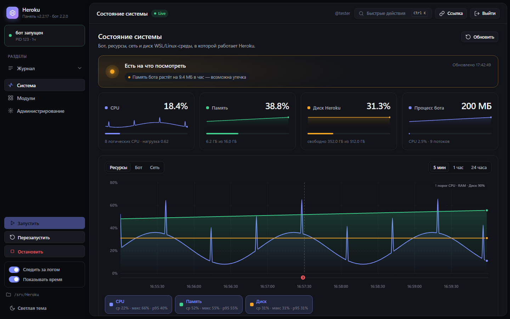
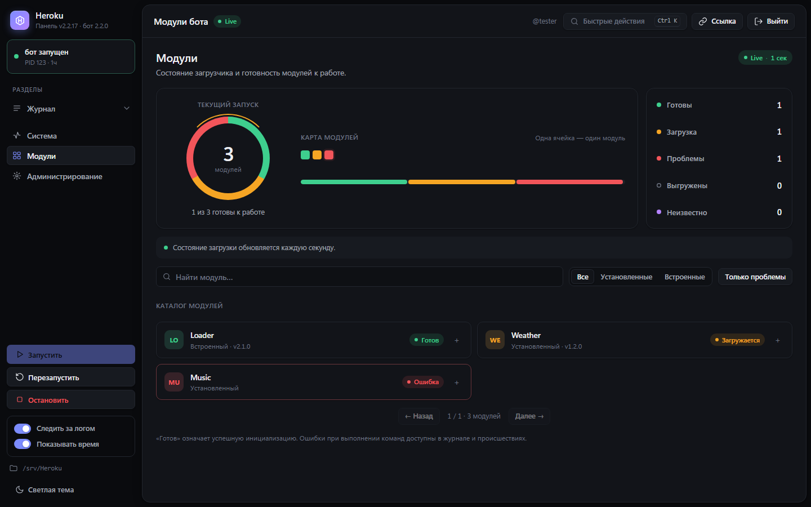
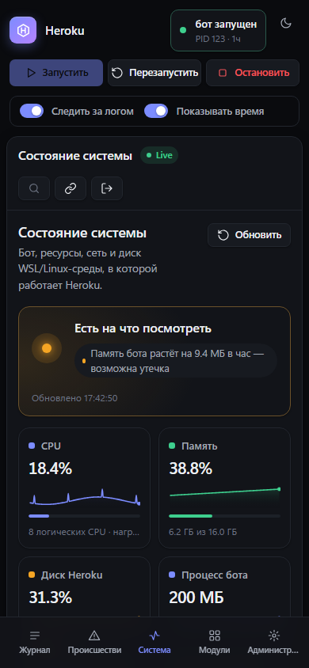

<div align="center">

# hrk-console

**Веб-панель для юзербота [Heroku](https://github.com/ZetGoHack/Heroku).**
Запуск и остановка бота, живой журнал, модули, нагрузка и уведомления в Telegram — в браузере, с телефона или компьютера.

[](https://github.com/ayanamisuicide/hrk-console/releases/latest)
[](https://github.com/ayanamisuicide/hrk-console/actions/workflows/ci.yml)
[](#установка)



</div>

## Установка

Нужны Linux или WSL с systemd и уже установленный Heroku. Одна команда:

```sh
curl -fsSL https://github.com/ayanamisuicide/hrk-console/releases/latest/download/install.sh | sudo bash
```

Установщик покажет каждый шаг, сам скачает и проверит сборку и запустит панель. Потом:

1. Откройте **http://localhost:8080/admin/**.
2. Введите токен администратора — его показывает команда `sudo grep HKC_ADMIN_TOKEN /etc/hkc/hkc.env`.
3. Создайте инвайт и зарегистрируйте по нему свой аккаунт.

> [!TIP]
> Бот лежит не в `~/Heroku`? Добавьте путь: `… | sudo bash -s -- --heroku-dir /путь/к/Heroku`.
> Проверить систему без установки: `… | sudo bash -s -- --dry-run`.

## Что умеет

|     |     |
| --- | --- |
| 🟢 **Управление ботом** | Запуск, остановка и перезапуск в один клик. Роли: оператор управляет, наблюдатель только смотрит. |
| 🛟 **Автовосстановление** | Бот упал или завис — панель перезапустит его сама. Если он падает снова и снова, остановится и сообщит. |
| 📜 **Живой журнал** | Лог в реальном времени, поиск, фильтры, закладки и экспорт. Ошибки собираются в «Происшествия». |
| 🧩 **Модули** | Какие модули загрузились, какие упали и почему. Кнопка ведёт прямо к ошибке в журнале. |
| 📈 **Система** | Сводка одной фразой, живой график, память и CPU бота, связь с Telegram, что занимает диск. |
| 🔔 **Уведомления** | В Telegram или на webhook: бот остановился, перезапустился, модуль упал, кончается место. |
| ⬆️ **Обновления** | Новая версия ставится из админки, а при сбое откатывается обратно. |
| 📱 **Где угодно** | Светлая и тёмная темы, удобно с телефона, ставится как приложение (PWA). |

<details>
<summary>Ещё скриншоты</summary>
<br>
<p align="center">
<br><br>

</p>
</details>

## Уведомления в Telegram

1. Создайте бота у [@BotFather](https://t.me/BotFather) и напишите ему что-нибудь.
2. Добавьте в `/etc/hkc/hkc.env` две строки и выполните `sudo systemctl restart hkc-web`:
   ```sh
   HKC_TELEGRAM_BOT_TOKEN="123456:ABC…"
   HKC_TELEGRAM_CHAT_ID="ваш ID"
   ```
3. В админке, в разделе «Уведомления», выберите события и нажмите «Отправить проверку».

## Частые вопросы

<details>
<summary><b>Остановил бота, а он снова запустился</b></summary>

Так работает автовосстановление: любая остановка для него — сбой. Чтобы бот оставался выключенным, сначала выключите автовосстановление в админке.
</details>

<details>
<summary><b>Бот не стартует из панели</b></summary>

Перед первым фоновым запуском один раз войдите в Telegram вручную из каталога бота: панель не умеет отвечать на вопросы авторизации. Ещё проверьте, что в каталоге есть `venv` или `.venv`.
</details>

<details>
<summary><b>Вкладка «Модули» пустая</b></summary>

Данные о модулях появятся после запуска бота из панели. Если бот запускается отдельно, выполните `HEROKU_DIR=/путь/к/Heroku /opt/hrk-console/bin/hkc-web --install-modules-bridge` и перезапустите бота.
</details>

<details>
<summary><b>Как открыть панель с другого компьютера?</b></summary>

По умолчанию панель доступна только локально. Для доступа извне поставьте перед ней HTTPS-прокси или Cloudflare Tunnel — [инструкция](docs/web.md#https-доступ). Не открывайте порт 8080 напрямую.
</details>

<details>
<summary><b>Как обновиться?</b></summary>

В админке, в разделе «Обновления», или повторным запуском установщика — настройки и токен сохранятся.
</details>

## Документация

- [Подробное руководство](docs/web.md) — настройки, переменные окружения, уведомления, HTTPS, обновление и откат.
- [Для разработчиков](docs/development.md) — устройство проекта, сборка из исходников и тесты.
- [История изменений](CHANGELOG.md)
